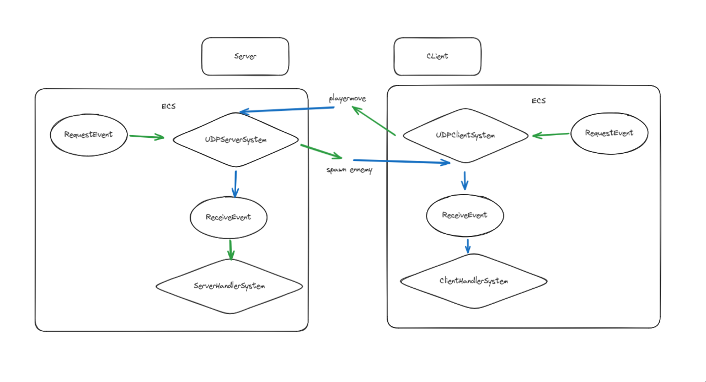

# Network Module Documentation

## Overview
This documentation provides a detailed explanation of the **Network Module** used in the game engine. The network module facilitates communication between the server and client using the **UDP protocol**. It integrates with the **ECS (Entity-Component-System)** architecture and leverages events to manage network requests and responses.

The module is composed of the following components:
1. **UDPServer**: Handles server-side communication.
2. **UDPClient**: Handles client-side communication.
3. **ServerHandlerSystem**: Processes incoming requests on the server.
4. **ClientHandlerSystem**: Processes incoming responses on the client.
5. **Events**: `RequestEvent` and `ReceiveEvent` are used to manage communication.



---

## Server
The server is responsible for listening for client requests, processing them, and sending responses back to the client.

### Main Function (Server)
The server's main function initializes the ECS, the server, and the event handlers:

```cpp
int main() {
    try {
        ECS ecs;
        ServerHandlerSystem server_handler;
        UDPServer server(ecs, 4242);

        ecs.register_event<RequestEvent>();
        ecs.register_event<ReceiveEvent>();

        ecs.subscribe<RequestEvent>(server);
        ecs.subscribe<ReceiveEvent>(server_handler);

        while(true) {
            if (!ecs.empty()) {
                auto &callback = ecs.front();
                callback();
                ecs.pop_front();
            }
        };
    } catch (std::exception& e) {
        std::cerr << "Error: " << e.what() << std::endl;
    }
    return 0;
}
```

### Components:
1. **`UDPServer`**:
   - Listens for incoming requests on a specified port (e.g., `4242`).
   - Handles events of type `RequestEvent` and sends responses back to clients.
   - Constructor: `UDPServer(ECS &ecs, unsigned short port)`
     - `ecs`: Reference to the ECS instance.
     - `port`: The port on which the server listens for incoming requests.

2. **`ServerHandlerSystem`**:
   - Processes events of type `ReceiveEvent`.
   - Implements the logic to handle data received from the client.

### Events:
- **`RequestEvent`**: Triggered when a client sends a request to the server.
- **`ReceiveEvent`**: Triggered when the server processes and receives data.

### Flow:
1. The server listens for incoming requests using `UDPServer`.
2. Incoming requests trigger a `RequestEvent`.
3. The `ServerHandlerSystem` processes the `ReceiveEvent` and handles the data.
4. Responses can be sent back to clients as needed.

---

## Client
The client is responsible for sending requests to the server and processing responses received from the server.

### Main Function (Client)
The client's main function initializes the ECS, the client, and the event handlers:

```cpp
int main() {
    try {
        ECS ecs;
        ClientHandlerSystem client_handler;
        UDPClient client(ecs, "127.0.0.1", "4242");

        ecs.register_event<RequestEvent>();
        ecs.register_event<ReceiveEvent>();

        ecs.subscribe<RequestEvent>(client);
        ecs.subscribe<ReceiveEvent>(client_handler);

        ecs.post<RequestEvent>({NetworkActions::CONNECT, {"action", "connect"}});

        while(true) {
            if (!ecs.empty()) {
                auto &callback = ecs.front();
                callback();
                ecs.pop_front();
            }
        };
    } catch (std::exception& e) {
        std::cerr << "Error: " << e.what() << std::endl;
    }
    return 0;
}
```

### Components:
1. **`UDPClient`**:
   - Establishes communication with the server at a given IP address and port.
   - Handles events of type `RequestEvent` and sends requests to the server.
   - Constructor: `UDPClient(ECS &ecs, const std::string &ip, const std::string &port)`
     - `ecs`: Reference to the ECS instance.
     - `ip`: The IP address of the server.
     - `port`: The port to connect to.

2. **`ClientHandlerSystem`**:
   - Processes events of type `ReceiveEvent`.
   - Implements the logic to handle data received from the server.

### Events:
- **`RequestEvent`**: Triggered when the client needs to send a request to the server.
- **`ReceiveEvent`**: Triggered when the client processes and receives data.

### Flow:
1. The client posts a `RequestEvent` to initiate communication with the server.
2. The `UDPClient` handles the `RequestEvent` and sends data to the server.
3. Incoming responses trigger a `ReceiveEvent`.
4. The `ClientHandlerSystem` processes the `ReceiveEvent` and handles the data.

---

## Events
The network module relies on two primary events:

### 1. `RequestEvent`
This event is triggered when a request needs to be sent over the network.

#### Structure:
```cpp
struct RequestEvent {
    const NetworkActions action;
    const nlohmann::json payload;
    const std::string receiver_uuid = "";
};
```
- **`action`**: Represents the type of network action (e.g., CONNECT, SEND, RECEIVE).
- **`payload`**: Contains the request data as a JSON object.
- **`receiver_uuid`**: The unique identifier of the target recipient (optional).

### 2. `ReceiveEvent`
This event is triggered when data is received over the network.

#### Structure:
```cpp
struct ReceiveEvent {
    const NetworkActions action;
    const nlohmann::json payload;
    const std::string sender_uuid = "";
};
```
- **`action`**: Represents the type of network action (e.g., CONNECT, SEND, RECEIVE).
- **`payload`**: Contains the received data as a JSON object.
- **`sender_uuid`**: The unique identifier of the sender (optional).

---

## Example Workflow
### Server Workflow:
1. The server starts and listens for requests on a specific port using `UDPServer`.
2. A client sends a request, triggering a `RequestEvent`.
3. The server processes the event and generates a `ReceiveEvent`.
4. The `ServerHandlerSystem` processes the received data and sends a response back if necessary.

### Client Workflow:
1. The client initializes and connects to the server using `UDPClient`.
2. A `RequestEvent` is posted to send data to the server.
3. The server processes the request and sends a response.
4. The client processes the response using `ClientHandlerSystem` when a `ReceiveEvent` is triggered.

---

## Conclusion
The network module provides a robust and event-driven framework for communication between the client and server. By leveraging the ECS architecture, the network logic remains modular and easy to maintain. This design ensures scalability and flexibility for game development or other applications requiring real-time communication.

